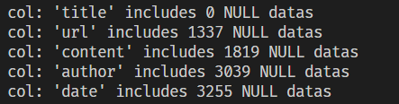
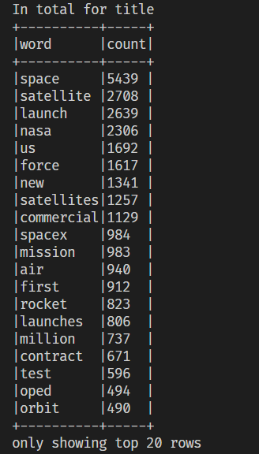
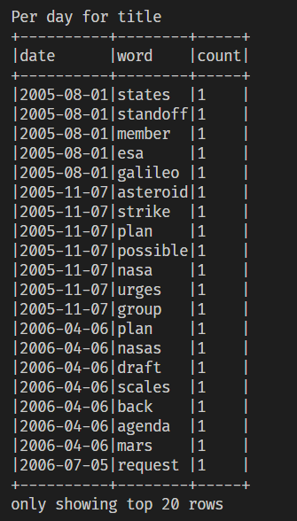
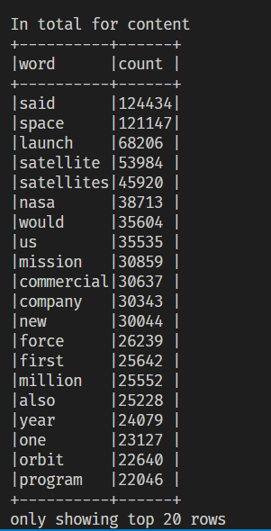
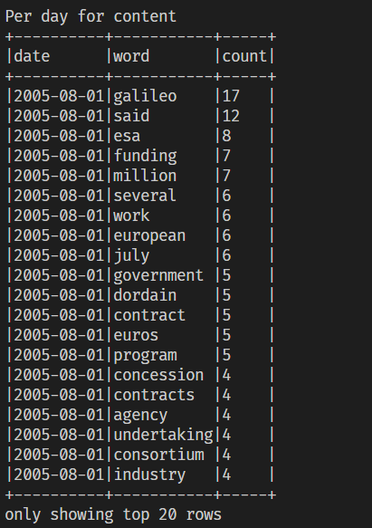
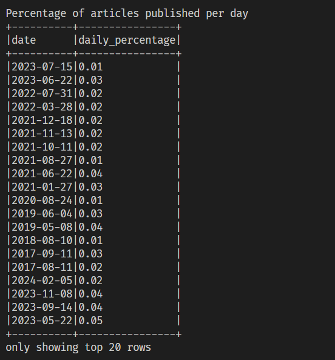
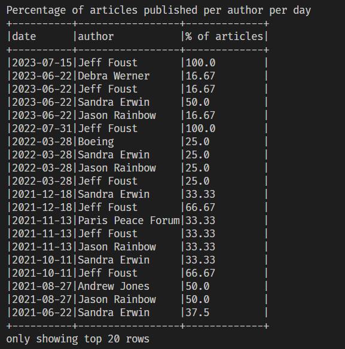
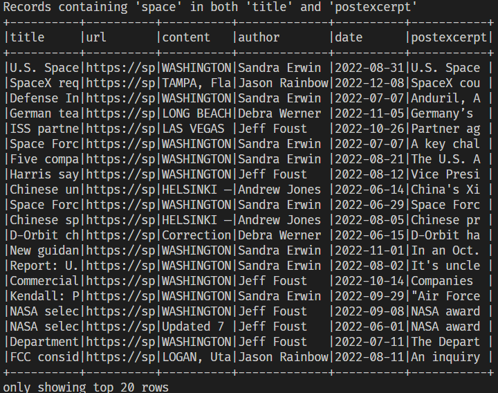

### Brief writeup of the HW1
>pre-processing

- formatting date values
- filter text by lowercases and removing punctuations and spaces with nltk library

> data analyze result

==since there are null values in "date" index, I'd seperated the data set, df_filter, which drops the null dates will be the datas regardings the analysis dealing with date==

>(1) (2)calculate freuqency

- Calculate total frequency with `df_total` 
- Use `df_filtered`  for date-associated calculations

> (3)calculate article published frequency
- use `df_filtered` 

>(4) Records containing 'space' in both 'title' and 'postexcerpt
-  use `df_total` 
- use substring to shorten the data and saved into csv
